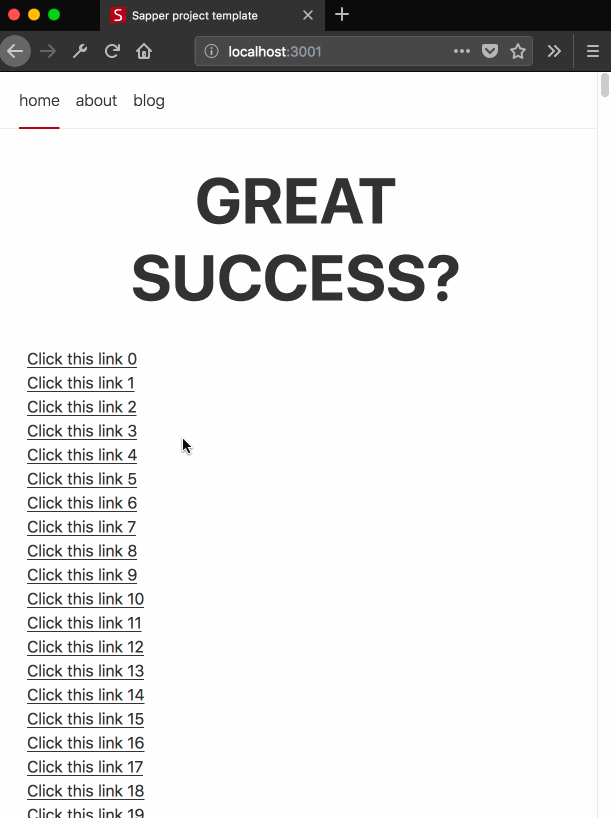

# sapper-template

The default [Sapper](https://github.com/sveltejs/sapper) template. To clone it and get started:

```bash
npx degit sveltejs/sapper-template my-app
cd my-app
npm install # or yarn!
npm run dev
```

Open up [localhost:3000](http://localhost:3000) and start clicking around.

## Reproduce the bug

Not seen in Chrome 67.0.3396.99

1. In Firefox 61.0.1...
1. Click on a link and it will appropriately jump you down to that portion of the page
1. Copy the url
1. Paste the url and hit <kbd>return</kbd>. The page will initially load and then jump back up to the top of the page.


